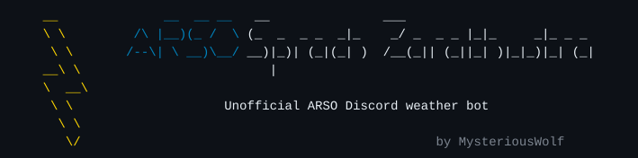

<div align="center">
  
</div>

This bot is not affiliated with [ARSO](https://www.arso.gov.si/) - it uses their public API.

## Prerequisites

- [uv](https://docs.astral.sh/uv/getting-started/installation/) - used to install and run the bot

## Quick start

```sh
uv tool install git+https://github.com/MysteriousWolf/arso-sprach-zarathustra
arso-sprach-zarathustra
```

A config file is generated on first launch. Fill in your Discord bot token and re-run.

## Run as a systemd service (Linux)

Requires a Linux system with systemd.

Install the bot, run it once to generate and fill the config, then set up the service:

```sh
uv tool install git+https://github.com/MysteriousWolf/arso-sprach-zarathustra
arso-sprach-zarathustra   # creates config in $XDG_CONFIG_HOME/arso-sprach-zarathustra/ (default ~/.config/), fill in your token

curl -fsSL https://raw.githubusercontent.com/MysteriousWolf/arso-sprach-zarathustra/master/arso-bot.service \
  | sed "s/YOUR_LINUX_USER/$USER/g" \
  > arso-bot.service

sudo cp arso-bot.service /etc/systemd/system/
sudo systemctl daemon-reload
sudo systemctl enable --now arso-bot
```

View logs:

```sh
journalctl -u arso-bot -f
```

## Development

```sh
git clone https://github.com/MysteriousWolf/arso-sprach-zarathustra
cd arso-sprach-zarathustra
uv run python main.py
```

Regenerate the banner SVG after visual changes:

```sh
uv run dev/gen_banner_svg.py
```

Preview generated images (saved to `dev/`):

```sh
uv run dev/dev_tools.py gradient   # day color gradient strip
uv run dev/dev_tools.py obeti      # 3-day forecast table
uv run dev/dev_tools.py vreme      # morning/evening weather table
```
